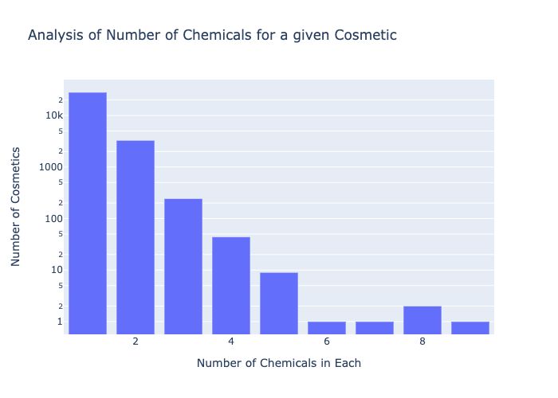
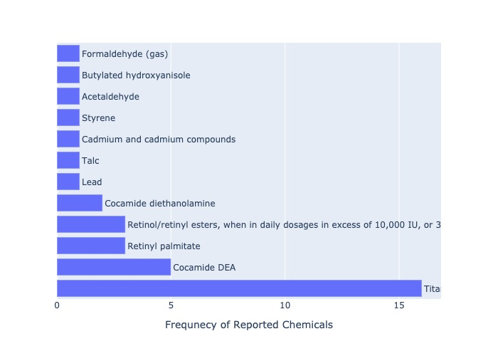

# Metadata
## Title: 
Analysis of Chemicals in Cosmetic Products with a focus on Baby Products
## Author:
**Name**: Sumuk Shashidhar

**Class**: Class XII A

**School**: Sri Kumaran Children's Home

## Dataset Used
[Chemicals in Cosmetics by Sumuk Shashidhar](https://raw.githubusercontent.com/sumukshashidhar/cosmetic-chemical-analysis/master/data/chemicals-in-cosmetics.csv)

# Imports and Requirements
For this project, we need the data sets and some python libraries


```python
import pandas as pd
import numpy as np
import plotly.express as px
import plotly.io as pio
import psutil
from IPython.display import Image

```

## Reading and cleaning the data


```python
df_original = pd.read_csv('./data/chemicals-in-cosmetics.csv')
df = df_original.drop_duplicates()
print('The original data had ', df_original.shape[0], "rows")
print('After removing duplicates, the data has', df.shape[0], "rows")
```

    The original data had  112870 rows
    After removing duplicates, the data has 112616 rows


### Sampling the data


```python
df.head()
```


<div>
<style scoped>
    .dataframe tbody tr th:only-of-type {
        vertical-align: middle;
    }

    .dataframe tbody tr th {
        vertical-align: top;
    }

    .dataframe thead th {
        text-align: right;
    }
</style>
<table border="1" class="dataframe">
  <thead>
    <tr style="text-align: right;">
      <th></th>
      <th>CDPHId</th>
      <th>ProductName</th>
      <th>CSFId</th>
      <th>CSF</th>
      <th>CompanyId</th>
      <th>CompanyName</th>
      <th>BrandName</th>
      <th>PrimaryCategoryId</th>
      <th>PrimaryCategory</th>
      <th>SubCategoryId</th>
      <th>...</th>
      <th>CasNumber</th>
      <th>ChemicalId</th>
      <th>ChemicalName</th>
      <th>InitialDateReported</th>
      <th>MostRecentDateReported</th>
      <th>DiscontinuedDate</th>
      <th>ChemicalCreatedAt</th>
      <th>ChemicalUpdatedAt</th>
      <th>ChemicalDateRemoved</th>
      <th>ChemicalCount</th>
    </tr>
  </thead>
  <tbody>
    <tr>
      <th>0</th>
      <td>2</td>
      <td>ULTRA COLOR RICH EXTRA PLUMP LIPSTICK-ALL SHADES</td>
      <td>NaN</td>
      <td>NaN</td>
      <td>4</td>
      <td>New Avon LLC</td>
      <td>AVON</td>
      <td>44</td>
      <td>Makeup Products (non-permanent)</td>
      <td>53</td>
      <td>...</td>
      <td>13463-67-7</td>
      <td>6</td>
      <td>Titanium dioxide</td>
      <td>06/17/2009</td>
      <td>08/28/2013</td>
      <td>02/01/2011</td>
      <td>07/09/2009</td>
      <td>07/09/2009</td>
      <td>NaN</td>
      <td>1</td>
    </tr>
    <tr>
      <th>1</th>
      <td>3</td>
      <td>Glover's Medicated Shampoo</td>
      <td>NaN</td>
      <td>NaN</td>
      <td>338</td>
      <td>J. Strickland &amp; Co.</td>
      <td>Glover's</td>
      <td>18</td>
      <td>Hair Care Products (non-coloring)</td>
      <td>25</td>
      <td>...</td>
      <td>65996-92-1</td>
      <td>4</td>
      <td>Distillates (coal tar)</td>
      <td>07/01/2009</td>
      <td>07/01/2009</td>
      <td>NaN</td>
      <td>07/01/2009</td>
      <td>07/01/2009</td>
      <td>NaN</td>
      <td>2</td>
    </tr>
    <tr>
      <th>2</th>
      <td>3</td>
      <td>Glover's Medicated Shampoo</td>
      <td>NaN</td>
      <td>NaN</td>
      <td>338</td>
      <td>J. Strickland &amp; Co.</td>
      <td>Glover's</td>
      <td>18</td>
      <td>Hair Care Products (non-coloring)</td>
      <td>25</td>
      <td>...</td>
      <td>140-67-0</td>
      <td>5</td>
      <td>Estragole</td>
      <td>07/01/2009</td>
      <td>07/01/2009</td>
      <td>NaN</td>
      <td>07/02/2009</td>
      <td>07/02/2009</td>
      <td>NaN</td>
      <td>2</td>
    </tr>
    <tr>
      <th>3</th>
      <td>4</td>
      <td>PRECISION GLIMMER EYE LINER-ALL SHADES �</td>
      <td>NaN</td>
      <td>NaN</td>
      <td>4</td>
      <td>New Avon LLC</td>
      <td>AVON</td>
      <td>44</td>
      <td>Makeup Products (non-permanent)</td>
      <td>46</td>
      <td>...</td>
      <td>13463-67-7</td>
      <td>7</td>
      <td>Titanium dioxide</td>
      <td>07/09/2009</td>
      <td>08/28/2013</td>
      <td>NaN</td>
      <td>07/09/2009</td>
      <td>07/09/2009</td>
      <td>NaN</td>
      <td>1</td>
    </tr>
    <tr>
      <th>4</th>
      <td>5</td>
      <td>AVON BRILLIANT SHINE LIP GLOSS-ALL SHADES �</td>
      <td>NaN</td>
      <td>NaN</td>
      <td>4</td>
      <td>New Avon LLC</td>
      <td>AVON</td>
      <td>44</td>
      <td>Makeup Products (non-permanent)</td>
      <td>52</td>
      <td>...</td>
      <td>13463-67-7</td>
      <td>8</td>
      <td>Titanium dioxide</td>
      <td>07/09/2009</td>
      <td>08/28/2013</td>
      <td>02/01/2011</td>
      <td>07/09/2009</td>
      <td>07/09/2009</td>
      <td>NaN</td>
      <td>1</td>
    </tr>
  </tbody>
</table>
<p>5 rows × 22 columns</p>
</div>


# Analysis
Let us look at the total number of chemicals that we have in our dataset


```python
df['ChemicalName'].value_counts().size
```


    123


It seems that we have a total of 123 chemicals in our given data

### Trends and Averages
Let us see what is the average number of reported chemicals, as well as the maximum and minimum for each product


```python
df['ChemicalCount'].describe()
```


    count    112616.000000
    mean          1.282402
    std           0.629696
    min           0.000000
    25%           1.000000
    50%           1.000000
    75%           1.000000
    max           9.000000
    Name: ChemicalCount, dtype: float64


This tells us that there are some products with no reported chemicals, and there arae some with as many as 9 reported chemicals.

However, the average seems to be around 1 chemical

### Removing some bias from our observations

It doesn't make sense that some products have no reported chemicals at all, so let us closely examine what we have


```python
df.loc[df.ChemicalCount==0].head()
```


<div>
<style scoped>
    .dataframe tbody tr th:only-of-type {
        vertical-align: middle;
    }

    .dataframe tbody tr th {
        vertical-align: top;
    }

    .dataframe thead th {
        text-align: right;
    }
</style>
<table border="1" class="dataframe">
  <thead>
    <tr style="text-align: right;">
      <th></th>
      <th>CDPHId</th>
      <th>ProductName</th>
      <th>CSFId</th>
      <th>CSF</th>
      <th>CompanyId</th>
      <th>CompanyName</th>
      <th>BrandName</th>
      <th>PrimaryCategoryId</th>
      <th>PrimaryCategory</th>
      <th>SubCategoryId</th>
      <th>...</th>
      <th>CasNumber</th>
      <th>ChemicalId</th>
      <th>ChemicalName</th>
      <th>InitialDateReported</th>
      <th>MostRecentDateReported</th>
      <th>DiscontinuedDate</th>
      <th>ChemicalCreatedAt</th>
      <th>ChemicalUpdatedAt</th>
      <th>ChemicalDateRemoved</th>
      <th>ChemicalCount</th>
    </tr>
  </thead>
  <tbody>
    <tr>
      <th>31</th>
      <td>24</td>
      <td>White Premium Lotion Soap</td>
      <td>NaN</td>
      <td>NaN</td>
      <td>181</td>
      <td>GOJO Industries, Inc.</td>
      <td>GOJO�</td>
      <td>74</td>
      <td>Personal Care Products</td>
      <td>170</td>
      <td>...</td>
      <td>68603-42-9</td>
      <td>26</td>
      <td>Cocamide diethanolamine</td>
      <td>07/23/2009</td>
      <td>02/07/2012</td>
      <td>NaN</td>
      <td>07/23/2009</td>
      <td>02/07/2012</td>
      <td>12/30/2010</td>
      <td>0</td>
    </tr>
    <tr>
      <th>497</th>
      <td>333</td>
      <td>Gentle Cleanser</td>
      <td>NaN</td>
      <td>NaN</td>
      <td>71</td>
      <td>Sunrider Manufacturing, L.P.</td>
      <td>Kandesn</td>
      <td>6</td>
      <td>Bath Products</td>
      <td>159</td>
      <td>...</td>
      <td>68603-42-9</td>
      <td>350</td>
      <td>Cocamide diethanolamine</td>
      <td>09/02/2009</td>
      <td>09/16/2013</td>
      <td>NaN</td>
      <td>09/02/2009</td>
      <td>09/16/2013</td>
      <td>11/23/2009</td>
      <td>0</td>
    </tr>
    <tr>
      <th>498</th>
      <td>334</td>
      <td>Cleansing Foam</td>
      <td>NaN</td>
      <td>NaN</td>
      <td>71</td>
      <td>Sunrider Manufacturing, L.P.</td>
      <td>Kandesn</td>
      <td>90</td>
      <td>Skin Care Products</td>
      <td>93</td>
      <td>...</td>
      <td>68603-42-9</td>
      <td>351</td>
      <td>Cocamide diethanolamine</td>
      <td>09/02/2009</td>
      <td>09/16/2013</td>
      <td>NaN</td>
      <td>09/02/2009</td>
      <td>09/03/2009</td>
      <td>09/02/2009</td>
      <td>0</td>
    </tr>
    <tr>
      <th>499</th>
      <td>334</td>
      <td>Cleansing Foam</td>
      <td>NaN</td>
      <td>NaN</td>
      <td>71</td>
      <td>Sunrider Manufacturing, L.P.</td>
      <td>Kandesn</td>
      <td>90</td>
      <td>Skin Care Products</td>
      <td>93</td>
      <td>...</td>
      <td>68603-42-9</td>
      <td>412</td>
      <td>Cocamide diethanolamine</td>
      <td>09/02/2009</td>
      <td>09/16/2013</td>
      <td>NaN</td>
      <td>09/03/2009</td>
      <td>12/05/2013</td>
      <td>09/02/2009</td>
      <td>0</td>
    </tr>
    <tr>
      <th>500</th>
      <td>334</td>
      <td>Cleansing Foam</td>
      <td>NaN</td>
      <td>NaN</td>
      <td>71</td>
      <td>Sunrider Manufacturing, L.P.</td>
      <td>Kandesn</td>
      <td>90</td>
      <td>Skin Care Products</td>
      <td>93</td>
      <td>...</td>
      <td>NaN</td>
      <td>453</td>
      <td>Retinol/retinyl esters, when in daily dosages ...</td>
      <td>09/02/2009</td>
      <td>09/16/2013</td>
      <td>NaN</td>
      <td>09/03/2009</td>
      <td>12/05/2013</td>
      <td>12/05/2103</td>
      <td>0</td>
    </tr>
  </tbody>
</table>
<p>5 rows × 22 columns</p>
</div>


The number of chemicals being equal to zero suggests that the chemicals were removed from the product (reported in 'ChemicalDateRemoved'). This can be verified by checking if there are NaN values in this column.


```python
df.loc[df.ChemicalCount==0]['ChemicalDateRemoved'].isnull().max()
```


    False


```python
df_n0 = df.loc[(df.ChemicalCount>0) & (df['DiscontinuedDate'].isna())]
```

The maximum number of chemicals that is reported in a product is 9. We can find these products:


```python
df_n0.loc[df.ChemicalCount==9]
```


<div>
<style scoped>
    .dataframe tbody tr th:only-of-type {
        vertical-align: middle;
    }

    .dataframe tbody tr th {
        vertical-align: top;
    }

    .dataframe thead th {
        text-align: right;
    }
</style>
<table border="1" class="dataframe">
  <thead>
    <tr style="text-align: right;">
      <th></th>
      <th>CDPHId</th>
      <th>ProductName</th>
      <th>CSFId</th>
      <th>CSF</th>
      <th>CompanyId</th>
      <th>CompanyName</th>
      <th>BrandName</th>
      <th>PrimaryCategoryId</th>
      <th>PrimaryCategory</th>
      <th>SubCategoryId</th>
      <th>...</th>
      <th>CasNumber</th>
      <th>ChemicalId</th>
      <th>ChemicalName</th>
      <th>InitialDateReported</th>
      <th>MostRecentDateReported</th>
      <th>DiscontinuedDate</th>
      <th>ChemicalCreatedAt</th>
      <th>ChemicalUpdatedAt</th>
      <th>ChemicalDateRemoved</th>
      <th>ChemicalCount</th>
    </tr>
  </thead>
  <tbody>
    <tr>
      <th>60819</th>
      <td>22212</td>
      <td>Moisturizing Shampoo</td>
      <td>NaN</td>
      <td>NaN</td>
      <td>165</td>
      <td>Regis Corporation</td>
      <td>Regis Design Line</td>
      <td>18</td>
      <td>Hair Care Products (non-coloring)</td>
      <td>25</td>
      <td>...</td>
      <td>123-91-1</td>
      <td>33796</td>
      <td>1,4-Dioxane</td>
      <td>02/04/2014</td>
      <td>02/04/2014</td>
      <td>NaN</td>
      <td>02/04/2014</td>
      <td>02/04/2014</td>
      <td>NaN</td>
      <td>9</td>
    </tr>
    <tr>
      <th>60820</th>
      <td>22212</td>
      <td>Moisturizing Shampoo</td>
      <td>NaN</td>
      <td>NaN</td>
      <td>165</td>
      <td>Regis Corporation</td>
      <td>Regis Design Line</td>
      <td>18</td>
      <td>Hair Care Products (non-coloring)</td>
      <td>25</td>
      <td>...</td>
      <td>79-06-1</td>
      <td>33797</td>
      <td>Acrylamide</td>
      <td>02/04/2014</td>
      <td>02/04/2014</td>
      <td>NaN</td>
      <td>02/04/2014</td>
      <td>02/04/2014</td>
      <td>NaN</td>
      <td>9</td>
    </tr>
    <tr>
      <th>60821</th>
      <td>22212</td>
      <td>Moisturizing Shampoo</td>
      <td>NaN</td>
      <td>NaN</td>
      <td>165</td>
      <td>Regis Corporation</td>
      <td>Regis Design Line</td>
      <td>18</td>
      <td>Hair Care Products (non-coloring)</td>
      <td>25</td>
      <td>...</td>
      <td>NaN</td>
      <td>33798</td>
      <td>Arsenic (inorganic arsenic compounds)</td>
      <td>02/04/2014</td>
      <td>02/04/2014</td>
      <td>NaN</td>
      <td>02/04/2014</td>
      <td>02/04/2014</td>
      <td>NaN</td>
      <td>9</td>
    </tr>
    <tr>
      <th>60822</th>
      <td>22212</td>
      <td>Moisturizing Shampoo</td>
      <td>NaN</td>
      <td>NaN</td>
      <td>165</td>
      <td>Regis Corporation</td>
      <td>Regis Design Line</td>
      <td>18</td>
      <td>Hair Care Products (non-coloring)</td>
      <td>25</td>
      <td>...</td>
      <td>79-43-6</td>
      <td>33799</td>
      <td>Dichloroacetic acid</td>
      <td>02/04/2014</td>
      <td>02/04/2014</td>
      <td>NaN</td>
      <td>02/04/2014</td>
      <td>02/04/2014</td>
      <td>NaN</td>
      <td>9</td>
    </tr>
    <tr>
      <th>60823</th>
      <td>22212</td>
      <td>Moisturizing Shampoo</td>
      <td>NaN</td>
      <td>NaN</td>
      <td>165</td>
      <td>Regis Corporation</td>
      <td>Regis Design Line</td>
      <td>18</td>
      <td>Hair Care Products (non-coloring)</td>
      <td>25</td>
      <td>...</td>
      <td>75-21-8</td>
      <td>33800</td>
      <td>Ethylene oxide</td>
      <td>02/04/2014</td>
      <td>02/04/2014</td>
      <td>NaN</td>
      <td>02/04/2014</td>
      <td>02/04/2014</td>
      <td>NaN</td>
      <td>9</td>
    </tr>
    <tr>
      <th>60824</th>
      <td>22212</td>
      <td>Moisturizing Shampoo</td>
      <td>NaN</td>
      <td>NaN</td>
      <td>165</td>
      <td>Regis Corporation</td>
      <td>Regis Design Line</td>
      <td>18</td>
      <td>Hair Care Products (non-coloring)</td>
      <td>25</td>
      <td>...</td>
      <td>50-00-0</td>
      <td>33801</td>
      <td>Formaldehyde (gas)</td>
      <td>02/04/2014</td>
      <td>02/04/2014</td>
      <td>NaN</td>
      <td>02/04/2014</td>
      <td>02/04/2014</td>
      <td>NaN</td>
      <td>9</td>
    </tr>
    <tr>
      <th>60825</th>
      <td>22212</td>
      <td>Moisturizing Shampoo</td>
      <td>NaN</td>
      <td>NaN</td>
      <td>165</td>
      <td>Regis Corporation</td>
      <td>Regis Design Line</td>
      <td>18</td>
      <td>Hair Care Products (non-coloring)</td>
      <td>25</td>
      <td>...</td>
      <td>7439-92-1</td>
      <td>33802</td>
      <td>Lead</td>
      <td>02/04/2014</td>
      <td>02/04/2014</td>
      <td>NaN</td>
      <td>02/04/2014</td>
      <td>02/04/2014</td>
      <td>NaN</td>
      <td>9</td>
    </tr>
    <tr>
      <th>60826</th>
      <td>22212</td>
      <td>Moisturizing Shampoo</td>
      <td>NaN</td>
      <td>NaN</td>
      <td>165</td>
      <td>Regis Corporation</td>
      <td>Regis Design Line</td>
      <td>18</td>
      <td>Hair Care Products (non-coloring)</td>
      <td>25</td>
      <td>...</td>
      <td>NaN</td>
      <td>33803</td>
      <td>Cocamide diethanolamine (DEA)</td>
      <td>02/04/2014</td>
      <td>02/04/2014</td>
      <td>NaN</td>
      <td>02/04/2014</td>
      <td>02/04/2014</td>
      <td>NaN</td>
      <td>9</td>
    </tr>
    <tr>
      <th>60827</th>
      <td>22212</td>
      <td>Moisturizing Shampoo</td>
      <td>NaN</td>
      <td>NaN</td>
      <td>165</td>
      <td>Regis Corporation</td>
      <td>Regis Design Line</td>
      <td>18</td>
      <td>Hair Care Products (non-coloring)</td>
      <td>25</td>
      <td>...</td>
      <td>107-21-1</td>
      <td>33804</td>
      <td>Ethylene glycol</td>
      <td>02/04/2014</td>
      <td>02/04/2014</td>
      <td>NaN</td>
      <td>02/04/2014</td>
      <td>02/04/2014</td>
      <td>NaN</td>
      <td>9</td>
    </tr>
  </tbody>
</table>
<p>9 rows × 22 columns</p>
</div>


Uh oh!

It turns out it is only one product, where each chemical is separately reported.

The following code is used to generate the bar chart showing the number of products per number of chemicals. In counting the number of products, different color, scent and/or flavor of the product are neglected (e.g. 'Professional Eyeshadow Base' can be beige or bright, but it is counted only once with the identification number 'CDPHId'=26).


```python
df_n0.loc[df['CDPHId']==26]
```


<div>
<style scoped>
    .dataframe tbody tr th:only-of-type {
        vertical-align: middle;
    }

    .dataframe tbody tr th {
        vertical-align: top;
    }

    .dataframe thead th {
        text-align: right;
    }
</style>
<table border="1" class="dataframe">
  <thead>
    <tr style="text-align: right;">
      <th></th>
      <th>CDPHId</th>
      <th>ProductName</th>
      <th>CSFId</th>
      <th>CSF</th>
      <th>CompanyId</th>
      <th>CompanyName</th>
      <th>BrandName</th>
      <th>PrimaryCategoryId</th>
      <th>PrimaryCategory</th>
      <th>SubCategoryId</th>
      <th>...</th>
      <th>CasNumber</th>
      <th>ChemicalId</th>
      <th>ChemicalName</th>
      <th>InitialDateReported</th>
      <th>MostRecentDateReported</th>
      <th>DiscontinuedDate</th>
      <th>ChemicalCreatedAt</th>
      <th>ChemicalUpdatedAt</th>
      <th>ChemicalDateRemoved</th>
      <th>ChemicalCount</th>
    </tr>
  </thead>
  <tbody>
    <tr>
      <th>32</th>
      <td>26</td>
      <td>Professional Eyeshadow Base</td>
      <td>337.0</td>
      <td>Beige</td>
      <td>27</td>
      <td>CHANEL, INC</td>
      <td>CHANEL</td>
      <td>44</td>
      <td>Makeup Products (non-permanent)</td>
      <td>48</td>
      <td>...</td>
      <td>13463-67-7</td>
      <td>27</td>
      <td>Titanium dioxide</td>
      <td>08/10/2009</td>
      <td>12/30/2010</td>
      <td>NaN</td>
      <td>08/10/2009</td>
      <td>08/10/2009</td>
      <td>NaN</td>
      <td>1</td>
    </tr>
    <tr>
      <th>33</th>
      <td>26</td>
      <td>Professional Eyeshadow Base</td>
      <td>338.0</td>
      <td>Bright</td>
      <td>27</td>
      <td>CHANEL, INC</td>
      <td>CHANEL</td>
      <td>44</td>
      <td>Makeup Products (non-permanent)</td>
      <td>48</td>
      <td>...</td>
      <td>13463-67-7</td>
      <td>27</td>
      <td>Titanium dioxide</td>
      <td>08/10/2009</td>
      <td>12/30/2010</td>
      <td>NaN</td>
      <td>08/10/2009</td>
      <td>08/10/2009</td>
      <td>NaN</td>
      <td>1</td>
    </tr>
  </tbody>
</table>
<p>2 rows × 22 columns</p>
</div>


```python
data = df_n0.groupby(['ChemicalCount']).nunique()['CDPHId']

```

We have grouped everything by unique CDPHId, so that we have no outlier values


```python
fig = px.bar(data, x=data.index, y=data.values, log_y=True, labels={
    "y":"Number of Cosmetics",
    "ChemicalCount":"Number of Chemicals in Each"
}, title="Analysis of Number of Chemicals for a given Cosmetic")
img_bytes = fig.to_image(format="png")
Image(img_bytes)
```


    

    


# Baby Products

We are starting the next part of our analysis which deals with baby products


```python
baby_prod = df_n0.loc[df_n0['PrimaryCategory']=='Baby Products']
baby_prod.head()
```


<div>
<style scoped>
    .dataframe tbody tr th:only-of-type {
        vertical-align: middle;
    }

    .dataframe tbody tr th {
        vertical-align: top;
    }

    .dataframe thead th {
        text-align: right;
    }
</style>
<table border="1" class="dataframe">
  <thead>
    <tr style="text-align: right;">
      <th></th>
      <th>CDPHId</th>
      <th>ProductName</th>
      <th>CSFId</th>
      <th>CSF</th>
      <th>CompanyId</th>
      <th>CompanyName</th>
      <th>BrandName</th>
      <th>PrimaryCategoryId</th>
      <th>PrimaryCategory</th>
      <th>SubCategoryId</th>
      <th>...</th>
      <th>CasNumber</th>
      <th>ChemicalId</th>
      <th>ChemicalName</th>
      <th>InitialDateReported</th>
      <th>MostRecentDateReported</th>
      <th>DiscontinuedDate</th>
      <th>ChemicalCreatedAt</th>
      <th>ChemicalUpdatedAt</th>
      <th>ChemicalDateRemoved</th>
      <th>ChemicalCount</th>
    </tr>
  </thead>
  <tbody>
    <tr>
      <th>14178</th>
      <td>3195</td>
      <td>Baby Don't Cry Shampoo</td>
      <td>22468.0</td>
      <td>Fragrance/parfum</td>
      <td>174</td>
      <td>John Paul Mitchell Systems</td>
      <td>John Paul Mitchell Systems</td>
      <td>1</td>
      <td>Baby Products</td>
      <td>3</td>
      <td>...</td>
      <td>100-42-5</td>
      <td>5734</td>
      <td>Styrene</td>
      <td>10/09/2009</td>
      <td>12/30/2010</td>
      <td>NaN</td>
      <td>10/09/2009</td>
      <td>10/09/2009</td>
      <td>NaN</td>
      <td>1</td>
    </tr>
    <tr>
      <th>19139</th>
      <td>4654</td>
      <td>Harmon Zinc Oxide Ointment 2oz</td>
      <td>NaN</td>
      <td>NaN</td>
      <td>266</td>
      <td>Harmon Stores Inc.</td>
      <td>Harmon Face Values</td>
      <td>1</td>
      <td>Baby Products</td>
      <td>4</td>
      <td>...</td>
      <td>7440-43-10</td>
      <td>8298</td>
      <td>Cadmium and cadmium compounds</td>
      <td>10/14/2009</td>
      <td>10/14/2009</td>
      <td>NaN</td>
      <td>10/14/2009</td>
      <td>10/14/2009</td>
      <td>NaN</td>
      <td>2</td>
    </tr>
    <tr>
      <th>19140</th>
      <td>4654</td>
      <td>Harmon Zinc Oxide Ointment 2oz</td>
      <td>NaN</td>
      <td>NaN</td>
      <td>266</td>
      <td>Harmon Stores Inc.</td>
      <td>Harmon Face Values</td>
      <td>1</td>
      <td>Baby Products</td>
      <td>4</td>
      <td>...</td>
      <td>7439-92-1</td>
      <td>8299</td>
      <td>Lead</td>
      <td>10/14/2009</td>
      <td>10/14/2009</td>
      <td>NaN</td>
      <td>10/14/2009</td>
      <td>10/14/2009</td>
      <td>NaN</td>
      <td>2</td>
    </tr>
    <tr>
      <th>20078</th>
      <td>5092</td>
      <td>Balmex Multi-Purpose Healing Ointment</td>
      <td>NaN</td>
      <td>NaN</td>
      <td>60</td>
      <td>Chattem, Inc.</td>
      <td>Balmex</td>
      <td>1</td>
      <td>Baby Products</td>
      <td>160</td>
      <td>...</td>
      <td>NaN</td>
      <td>8860</td>
      <td>Retinol/retinyl esters, when in daily dosages ...</td>
      <td>10/15/2009</td>
      <td>08/04/2015</td>
      <td>NaN</td>
      <td>10/15/2009</td>
      <td>08/04/2015</td>
      <td>NaN</td>
      <td>1</td>
    </tr>
    <tr>
      <th>20083</th>
      <td>5096</td>
      <td>Balmex Prevention Baby Powder</td>
      <td>NaN</td>
      <td>NaN</td>
      <td>60</td>
      <td>Chattem, Inc.</td>
      <td>Balmex</td>
      <td>1</td>
      <td>Baby Products</td>
      <td>4</td>
      <td>...</td>
      <td>NaN</td>
      <td>8865</td>
      <td>Retinol/retinyl esters, when in daily dosages ...</td>
      <td>10/15/2009</td>
      <td>08/04/2015</td>
      <td>NaN</td>
      <td>10/15/2009</td>
      <td>08/04/2015</td>
      <td>NaN</td>
      <td>1</td>
    </tr>
  </tbody>
</table>
<p>5 rows × 22 columns</p>
</div>


### Commonality of Chemicals
Let us see which chemicals are present in these products


```python
baby_prod_chem = baby_prod['ChemicalName'].value_counts()
print(baby_prod_chem)
```

    Titanium dioxide                                                                                       16
    Cocamide DEA                                                                                            5
    Retinyl palmitate                                                                                       3
    Retinol/retinyl esters, when in daily dosages in excess of 10,000 IU, or 3,000 retinol equivalents.     3
    Cocamide diethanolamine                                                                                 2
    Lead                                                                                                    1
    Talc                                                                                                    1
    Cadmium and cadmium compounds                                                                           1
    Styrene                                                                                                 1
    Acetaldehyde                                                                                            1
    Butylated hydroxyanisole                                                                                1
    Formaldehyde (gas)                                                                                      1
    Name: ChemicalName, dtype: int64


We see that Titanium Dioxide is present in a lot of baby cosmetic products

Fortunately, according to [this](https://www.ncbi.nlm.nih.gov/pmc/articles/PMC3423755/#:~:text=Titanium%20dioxide%20(TiO2)%20is,are%20increasingly%20manufactured%20and%20used.) resource, we see that $TiO_2$ is inert and safe


```python
fig = px.bar(y=baby_prod_chem.index, x=baby_prod_chem.values, text=baby_prod_chem.index, labels={
    "x":"Frequnecy of Reported Chemicals"
})
fig.update_traces(texttemplate='', textposition='outside')
fig.update_layout(uniformtext_minsize=8, uniformtext_mode='hide')
fig.update_yaxes(visible=False)
img_bytes = fig.to_image(format="jpeg")
Image(img_bytes)
```


    

    


# Conclusion

In essence, most chemicals that are found in Baby Chemical Products are safe. However, concerned parents and other stakeholders can consult this data to be sure and be wary of the various chemicals present in their children's cosmetic products
